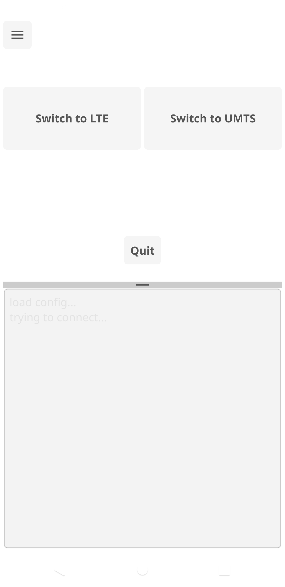

# Keenetic mode switch

A small cross-platform application that helps to switch modem mode between umts and lte, 
as well as to configure init string. This is needed for old routers whose firmware is no longer supported and is 
frozen at version 2.16.D.12.0-8, for example Keenetic LTE. This app just sends the necessary commands via telnet or ssh 
to the router.

## Build
You need to install [fyne-cross](https://github.com/fyne-io/fyne-cross). fyne-cross is a simple tool to cross compile and create 
distribution packages for Fyne applications using docker images.
```bash
$ go install github.com/fyne-io/fyne-cross@latest
```
By default, you can build android application:
```bash
$ make 
```
if you want to build application for other platform use the next command:
```bash
$ fyne-cross target
```
where the target is one of the several platforms such as darwin, linux, windows, android, ios, freebsd, web.
## Run
Transfer _./fyne-cross/dist/android/_**Keenetic_Mode_Switch.apk** to the android smartphone and use it after installation.

<p align="center">


</p>